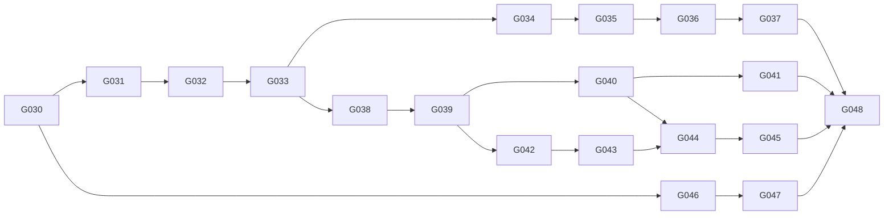

# Jupiter Master Upgrade Plan

## GOAL-051 — پوشش کامل metering برای AI Smart Actions (complete)

`AI_TICKET_REVIEW` و `AI_SMART_INTAKE` به مرز تجاری مشترک رزرو، telemetry امن و تسویهٔ تحویل موفق متصل شدند. تبدیل مستقل صوت تجاری نشده و گزارش‌های Owner/Platform فقط projection مجاز را نشان می‌دهند.

## GOAL-050 — چرخهٔ عمر اشتراک تجاری (complete)

Commercial subscriptions now use the official lifecycle states, Platform-controlled audited transitions, a tenant-configured grace window, safe expiry processing and owner-visible Persian lifecycle state. Core ticketing remains independent from commercial expiry.

## GOAL-049 — کنترل تجاری مالک و مصرف مازاد (complete)

Commercial Core بدون پرداخت به سیاست overage tenant-scoped، درخواست‌های ADDON/RENEWAL/SERVICE_ACTIVATION، رسیدگی Platform و داشبورد RTL مالک ارتقا یافت. ترتیب مصرف و قاعدهٔ تحویل موفق Smart Action حفظ شد.

**Status:** approved program baseline; GOAL-030 through GOAL-048 complete.

## 1. Purpose and immutable boundaries

This program evolves Jupiter from an internal multi-tenant ticketing product
into an approved, commercially operated platform. It extends the existing
TypeScript modular monolith; it does not introduce microservices, replace the
tenant model, alter fixed ticket semantics, accept tenant BYOK credentials, or
introduce autonomous ticket submission.

Every delivery Goal must include implementation, targeted tests, `.ai` updates,
Persian user/admin help impact, security review, and evidence. One execution
completes exactly one Goal. All schema changes are forward-only, data-preserving
and tenant-safe.

## 2. Baseline and reusable capabilities

The current system has a global `User`, tenant `Membership`, PostgreSQL RLS,
JWT/refresh sessions, auditable platform administration, S3 storage, outbox
processing, AI Gateway isolation, organization AI configuration, an RTL design
system, and a route-addressable organization administration workspace. These
are reused. Existing ticket, membership, AI history, and organization data are
preserved.

Current constraints that require additive evolution are: email and password are
currently required on `users`; organization state supports only active and
suspended; platform administration is a flag rather than a membership role;
and the current knowledge base is tenant content, not product help.

## 3. Approved architecture decisions

The controlling decisions are DEC-018 through DEC-027 in `DECISIONS.md`.
Highlights:

- Identity is evolved additively: retain `User` and `Membership`, introduce
  separate authentication identity and tenant-scoped directory-principal
  records only where required. Legacy credentials remain compatible during a
  staged migration.
- Public-account email verification is required before an organization
  application can enter `SUBMITTED`; its delivery uses a pluggable, audited
  notification path and a test-only local sink.
- Organization applications use exactly `DRAFT`, `SUBMITTED`, `UNDER_REVIEW`,
  `NEEDS_INFORMATION`, `APPROVED`, `REJECTED`, and `CANCELLED`.
- Existing organizations remain operational without an `ORG_OWNER`. Owner-only
  commercial actions remain unavailable until a Platform Admin explicitly
  assigns or invites an owner; no existing `ORG_ADMIN` is automatically
  promoted.
- Tenant URLs use `/o/{slug}`. A legacy route redirects only when tenant
  resolution is unambiguous.
- The commercial core is intentionally minimal: Product, Subscription,
  Entitlement, Allowance, Usage Ledger, Add-on Package, Agreement, Platform
  Availability and Organization Feature Setting. Product versioning is deferred
  until a concrete compatibility or pricing requirement exists.
- A provider call is never intrinsically billable. A customer allowance settles
  only after one successfully delivered, customer-facing Commercial Smart
  Action. Diagnostics, tests, retries, infrastructure work, invalid output and
  duplicate delivery never consume a customer unit.
- Windows connector implementation choices remain validated candidates. The
  security invariants are Windows service execution, outbound HTTPS only, no AD
  credentials in the cloud, short-lived single-use pairing, and revocable
  device identity.
- Jupiter Assist access is separate from tenant membership and uses scoped,
  time-bound, revocable, audited grants. Ticket lifecycle and Assist lifecycle
  remain independent.
- Product Help is a separate, versioned capability. Repository documents seed
  first publication; runtime database revisions are the published source of
  truth.

## 4. Target modules and public contracts

New Nest modules remain inside the modular monolith:

1. Public Accounts and Organization Applications
2. Tenant Provisioning and Setup
3. Directory Provisioning and Connector Control Plane
4. Commercial Core and Capability Resolver
5. AI Commercial Metering
6. Jupiter Assist
7. Product Help and controlled Appearance

New REST endpoints remain under `/api/v1`. Families will be introduced only in
their owning Goal: public accounts/applications, platform application review and
provisioning, `/o/:slug` tenant context, directory administration, commercial
administration, Assist, Help, and platform appearance. Authorization is always
server-side and combines authentication, tenant, role, entitlement and scope.

The common commercial decision contract is:

```ts
type CapabilityDecision = {
  entitled: boolean;
  enabled: boolean;
  available: boolean;
  effective: boolean;
  reasonCode:
    | "AVAILABLE"
    | "NOT_ENTITLED"
    | "DISABLED_BY_ORGANIZATION"
    | "PLATFORM_UNAVAILABLE"
    | "ALLOWANCE_EXHAUSTED";
};
```

`Effective Capability = Entitlement AND Organization Setting AND Platform
Availability`.

## 5. Program sequence and dependencies

| Goal | Deliverable | Depends on |
| --- | --- | --- |
| GOAL-030 | Upgrade program baseline and ADRs | GOAL-029 |
| GOAL-031 | Selected identity evolution and application foundation | GOAL-030 |
| GOAL-032 | Public application and verification flow | GOAL-031 |
| GOAL-033 | Review, approval, provisioning, lifecycle and slug | GOAL-032 |
| GOAL-034 | Tenant routing, owner transition and resumable setup | GOAL-033 |
| GOAL-035 | Manual and CSV user provisioning | GOAL-034 |
| GOAL-036 | Directory connector domain, pairing and control plane | GOAL-035 |
| GOAL-037 | Windows connector and directory sync lifecycle | GOAL-036 |
| GOAL-038 | Minimal commercial core | GOAL-033 |
| GOAL-039 | Entitlement, settings, availability and capability resolution | GOAL-038 |
| GOAL-040 | Allowances, packs and immutable usage ledger | GOAL-039 |
| GOAL-041 | Commercial Smart Action metering for AI | GOAL-040 |
| GOAL-042 | Jupiter Assist commercial and access foundation | GOAL-039 |
| GOAL-043 | Assist lifecycle and organization/platform UI | GOAL-042 |
| GOAL-044 | Organization commercial dashboard and owner controls | GOAL-040, GOAL-043 |
| GOAL-045 | Platform commercial console and governed appearance | GOAL-044 |
| GOAL-046 | Help article domain and repository seed pipeline | GOAL-030 |
| GOAL-047 | Help authoring, discovery, export and contextual mapping | GOAL-046 |
| GOAL-048 | Cross-domain hardening, migration rehearsal and final acceptance | GOAL-037, GOAL-041, GOAL-045, GOAL-047 |



## 6. Migration and security gates

- Existing organizations retain their current access and active/suspended
  behavior. `SETUP` is additive and used by newly provisioned organizations.
- The identity migration must retain existing email/username login and refresh
  behavior. Directory provisioning does not copy passwords; a directory member
  without a verified local login remains visibly not-ready to sign in.
- Tenant-scoped tables require RLS, composite integrity and cross-tenant tests.
- Provisioning, CSV imports, connector sync, commercial adjustments, usage
  settlement, and Assist acceptance require idempotency and minimal audits.
- Commercial availability is enforced by APIs, never only by navigation or UI.
- AI quotas use an atomic reserve/release/settle flow. Manual ticketing always
  remains available.
- Restricted tickets remain hidden from Jupiter agents without an explicit
  matching support grant, including under full-support scope.
- Connector tests must prove organization binding, expired pairing rejection,
  revocation, replay denial and absence of cloud-held AD credentials.
- Help tests must prove audience filtering and draft/unpublished non-disclosure.

## 7. Persian help and UI requirements

`.ai` remains developer/agent knowledge; product Help is independent user/admin
knowledge. Until GOAL-046, each Goal records its Persian help impact in its
evidence. From GOAL-046 onward, delivered user-facing behavior must add or
update structured Help content in Persian.

All UI remains Persian-first, RTL, Shabnam-first with Vazirmatn fallback, and
uses Design System V2. New screens are checked at 375, 768, 1024 and 1440px
without document horizontal overflow. Standard terminology includes «سهمیه»،
«بسته افزایشی»، «مصرف مازاد»، «پشتیبانی موردی»، «پشتیبانی پشتیبان» and
«درخواست کمک از تیم Jupiter».

## 8. Current evidence and next gate

GOAL-030 was documentation-only. It created this plan and the associated ADRs,
updates the architecture/domain/security/testing documents, records Persian
help applicability, and prepares GOAL-031. It must not add application code,
API routes, dependencies or migrations.

GOAL-031 implemented migration 033, additive public email-password identities,
tenant-RLS-protected directory principals, hashed/single-use verification
tokens, persisted delivery state, exact organization application statuses,
applicant ownership, idempotent transitions and minimal audits. Legacy
email/username credentials remain functional. Its evidence is
`docs/GOAL_031_EVIDENCE.md` and its REST contract is
`docs/ORGANIZATION_APPLICATION_API.md`.

GOAL-032 delivered the public application experience and a deployment-ready
verification delivery adapter. Its evidence is `docs/GOAL_032_EVIDENCE.md` and
the updated REST/operational contracts are `docs/ORGANIZATION_APPLICATION_API.md`
and `docs/OPERATIONS_RUNBOOK.md`.

GOAL-033 implements Platform Admin review, exact lifecycle transitions and
atomic/idempotent setup-tenant provisioning with the initial applicant owner.
Its evidence is `docs/GOAL_033_EVIDENCE.md`. Existing organizations and
existing `ORG_ADMIN` members remain unchanged. Authenticated responsive browser
acceptance passed at 375, 768, 1024 and 1440px without document overflow.
GOAL-034 delivered canonical `/o/{slug}` routing, server-resolved membership
context, conservative legacy routing, explicit legacy-owner transition and a
resumable owner setup/activation path. Its evidence is
`docs/GOAL_034_EVIDENCE.md`.

GOAL-035 delivered owner-aware manual member governance and a tenant-RLS-safe
CSV preview/confirmation flow. Migration 036 stores only a non-secret payload
hash and result for each import key; passwords are never returned or audited.
Its evidence is `docs/GOAL_035_EVIDENCE.md`. GOAL-036 may begin.

GOAL-036 delivered the Directory Connector Control Plane: tenant-RLS connector
records, 15-minute single-use hashed pairing, one-time device token delivery,
revocation and a validation matrix without adopting an implementation candidate.
Its evidence is `docs/GOAL_036_EVIDENCE.md`. GOAL-037 may begin.

GOAL-037 delivered the validated PowerShell/WinSW connector scaffold,
DPAPI-local configuration and an outbound-only rotating-device protocol.
Migration 038 adds RLS-protected preview/apply lifecycle records, no-email
directory provisioning and source-tracked non-administrative role grants. Its
evidence is `docs/GOAL_037_EVIDENCE.md`. GOAL-038 may begin.

GOAL-038 delivered migration 039 and the intentionally minimal commercial
record boundary: Product, Subscription, Entitlement, Add-on Package,
Organization Commercial Agreement, Usage Allowance, Usage Ledger, Platform
Availability and Organization Feature Setting. Platform Admin-only Persian
controls manage the product catalog and organization agreements; no Product
Version, payments, capability resolution or settlement behavior was added.
The evidence is `docs/GOAL_038_EVIDENCE.md`. GOAL-039 may begin.

GOAL-039 delivered the tenant-safe, server-side effective-capability resolver:
active entitlement AND enabled organization setting AND available platform
capability. Platform Admin can manage/view each input in the Persian commercial
console, while later consumers can use `requireEffective` as a backend gate.
The goal introduced no allowance settlement or AI execution. Its evidence is
`docs/GOAL_039_EVIDENCE.md`. GOAL-040 may begin.

GOAL-040 delivered idempotent periodic/emergency allowance allocations,
configured add-on packages and RLS-bound package allocations. The application
role cannot update or delete the immutable Usage Ledger, and allocation retries
write no duplicate event. It does not consume or settle a customer unit. Its
evidence is `docs/GOAL_040_EVIDENCE.md`. GOAL-041 may begin.

GOAL-041 delivered migration 041 and the first permitted customer-facing
commercial Smart Action, `AI_TICKET_REVIEW`. It atomically reserves capacity,
releases failed or undelivered work, and settles exactly once after an
authorized persisted result; periodic allowance is selected before add-on and
emergency capacity. Provider activity, diagnostics and retries remain
non-billable. Its evidence is `docs/GOAL_041_EVIDENCE.md`. GOAL-042 may begin.

GOAL-042 delivered migration 042, minimal platform-managed Assist policy/capacity, a global Jupiter support-agent registry and tenant-safe delegated support grants. Jupiter agents receive no tenant membership, and restricted tickets require a matching explicit grant. It adds no Assist workflow, SLA or settlement. Its evidence is `docs/GOAL_042_EVIDENCE.md`.

GOAL-043 delivered migration 043, an independent Assist-case lifecycle, requested/approval/queue states, acceptance-time SLA and exactly-once capacity settlement. Ticket status remains unchanged and the requester can ask for «کمک از تیم Jupiter» from the ticket. Additional access requests remain scoped and restricted-ticket access remains grant-checked. Its evidence is `docs/GOAL_043_EVIDENCE.md`. GOAL-044 may begin.

GOAL-044 delivered the explicit-owner, tenant-bound commercial dashboard with a concise Persian allowance, pack, AI and Assist summary. It does not grant authority to legacy administrators or ownerless organizations. Its evidence is `docs/GOAL_044_EVIDENCE.md`.

GOAL-045 delivered platform-commercial Assist controls and persisted governed appearance. Platform Admin can manage Jupiter support agents plus per-organization Assist policy, capacity and SLA without creating tenant membership. Migration 044/044a adds a single auditable, preset-only platform appearance record; approved palette, density, radius and internal logo choices are applied across the shell while organization branding remains a narrower logo override. Its evidence is `docs/GOAL_045_EVIDENCE.md`. GOAL-046 may begin.

GOAL-046 delivered the separate global Product Help domain. Migration 045/045a
adds versioned articles/revisions with a current-published pointer, audience,
Persian discovery/context metadata and source lineage; no tenant knowledge
table or ownership rule changed. Repository Markdown under `docs/help/` seeds
only missing articles and is idempotent, while database revisions are runtime
truth. Read APIs return only current published revisions whose audience matches
the server-derived viewer; draft, unpublished and unauthorized slugs are
non-disclosing. Its evidence is `docs/GOAL_046_EVIDENCE.md`. GOAL-047 may
begin.

GOAL-047 delivered Platform Admin-only Product Help authoring, revision
preview/publish/unpublish/restore and published-only Markdown/JSON exports for
one article, a category or all Help. The Persian Help Center provides
audience-aware discovery, while compact HelpTriggers map AI, directory and
Jupiter Assist settings to approved Help. It neither changes tenant knowledge
ownership nor adds RAG/AI chat. Its evidence is `docs/GOAL_047_EVIDENCE.md`.
GOAL-048 may begin.
